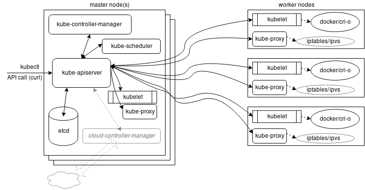

# Architecture

## Master

Is a collection of components

### etcd

A scalable database used for maintaining the state of the kubernetes cluster

### kube-apiserver

Central tool used for all internal and external traffic and only tool that connects to the etcd. This is the front-end API manager that kubectl uses

### kube-control-manager

### kube-scheduler

Takes requests and sends them to the worker nodes to action

## Minion / Worker Nodes

Each worker node has the following components installed

### kubelet

Connects to the master node. It interacts with the container enginer to run / manage containers. It manages storage / secrets / configmaps for pods.

The kubelet will also pulldown images to the node so will need access to resources needed (ECR / Dockerhub).

### kube-proxy

Manages network connectivity (via iptables)

### Container engine

ie docker, containerd, cri-o etc
